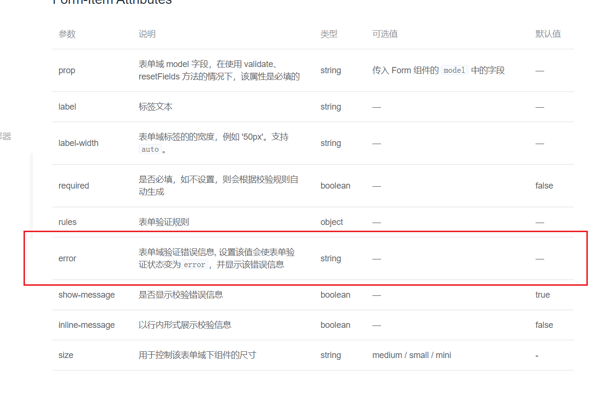

## 参考资料:

1. [element form 表单组件重复错误提示不显示](https://andyliwr.github.io/2017/12/25/element_form_validate/#)

## 问题描述

element-ui 的表单校检,仅在用户静态输入之后,进行校检,但是我们想,当数据提供给后台,后台返回的错误信息,显示在表单上,来通知用户

## 问题解决方案

### 1. 手动更改 error

在 element-ui 的 form 表单文档中:



即在需要动态修改错误信息的表单上,添加一个:error 属性,然后手动的修改

但这种方式,有如下缺陷:

1. 错误显示,error 赋值相同不会出现错误
2. 当此表单获得焦点,然后再失去焦点,会导致信息丢失

但优点:

1. 但胜于简单,只需要绑定一个 error 就好了

**解决缺陷 error 重复不显示的问题:**<br/>
解决方式是：

先将 errorMsg 设置为 null，再使用

```js
this.$nextTick(() => {
  this.erroMsg = res.data.message;
});
```

参考: [这篇文章](https://andyliwr.github.io/2017/12/25/element_form_validate/#)

可知解决方案:

1. 要么全部手写,单单使用 error
2. 要么使用 valid,舍弃动态显示

### 2. 设定一个特定的 name 属性错误,然后手动触发

1. 设定一个特定 rules

```js
const validateUsername = (rule, value, callback) => {
  if (!value) {
    callback(new Error("用户名不能为空"));
  } else {
    if (value === "****") {
      callback(new Error("用户名重复"));
    }
    callback();
  }
};
```

2. 在特定的地方,手动设置成相对应的字符串

```js
this.$refs["registerForm"].validate((valid) => {
  this.messageError = "";
  if (valid) {
    // 将username设置成对应的错误信息
    this.registerForm.username = "****";
    // 校检
    this.$refs.registerForm.validateField("username");

    // 为了,字段显示不为 "****",将username设置成空
    this.registerForm.username = "";
  }
});
```

优点:(即完美的解决了方式一的缺陷)
1. 解决了只显示一次
2. 移除不会消失错误消息

缺点:
1. 会导致 `username` 的选择少了几个(虽然并不影响)
