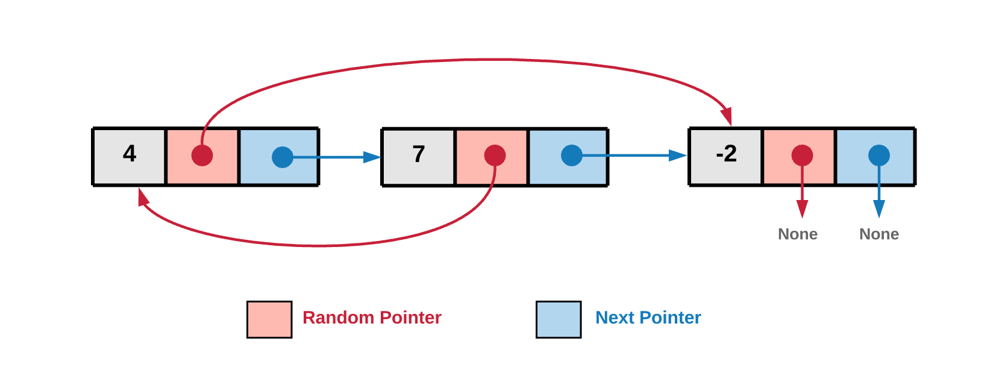
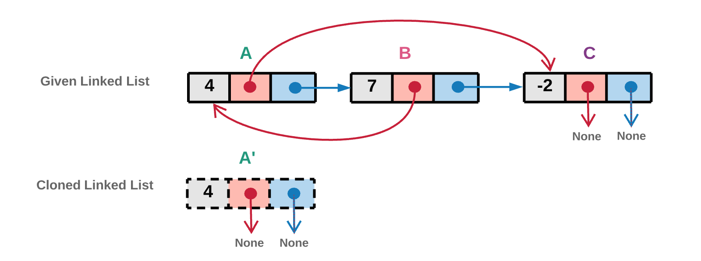
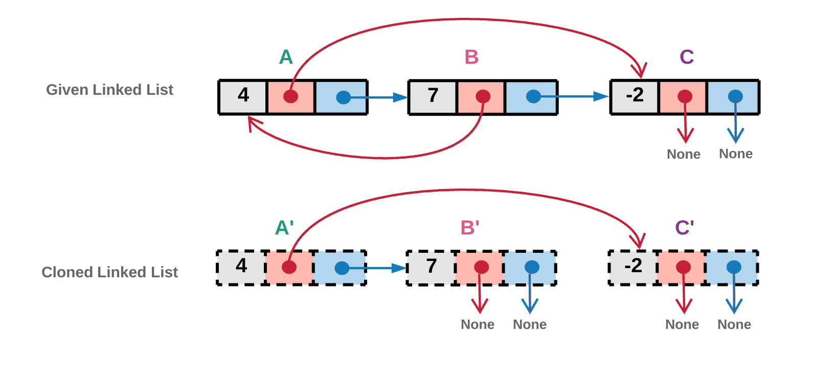
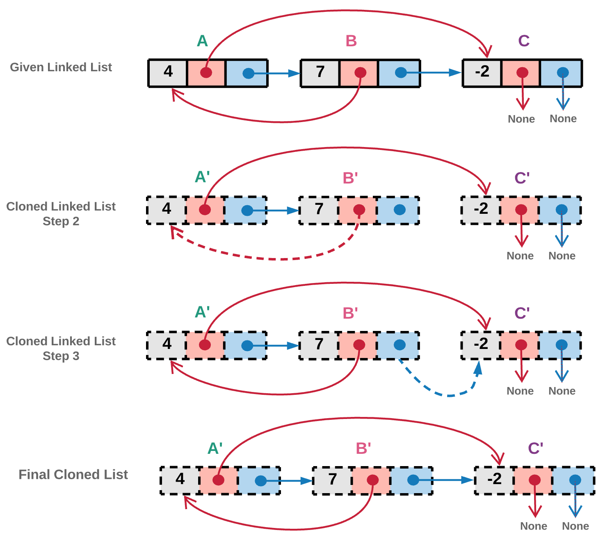

## 参考资料

1. [leetcode 高级算法](https://leetcode-cn.com/leetbook/detail/top-interview-questions-hard/)
2. [复制带随机指针的链表](https://leetcode-cn.com/problems/copy-list-with-random-pointer/description/)
## 复制带随机指针的链表
给定一个链表，每个节点包含一个额外增加的随机指针，该指针可以指向链表中的任何节点或空节点。

要求返回这个链表的 [深拷贝](https://baike.baidu.com/item/%E6%B7%B1%E6%8B%B7%E8%B4%9D/22785317?fr=aladdin)。 

我们用一个由 n 个节点组成的链表来表示输入/输出中的链表。每个节点用一个 `[val, random_index]` 表示：

- `val`：一个表示 `Node.val` 的整数。
- `random_index`：随机指针指向的节点索引（范围从 `0` 到 `n-1`）；如果不指向任何节点，则为  null 。

### 示例 1：


```bash
输入：head = [[7,null],[13,0],[11,4],[10,2],[1,0]]
输出：[[7,null],[13,0],[11,4],[10,2],[1,0]]
```
### 示例 2:


```bash
输入：head = [[1,1],[2,1]]
输出：[[1,1],[2,1]]
```
### 示例 3：


```bash
输入：head = [[3,null],[3,0],[3,null]]
输出：[[3,null],[3,0],[3,null]]
```
### 示例 4：
```bash
输入：head = []
输出：[]
解释：给定的链表为空（空指针），因此返回 null。
```
### 提示：

- `-10000 <= Node.val <= 10000`
- `Node.random` 为空（null）或指向链表中的节点。
- 节点数目不超过 1000 。


## 前言
首先，我们来看一下有向链表：



在上图中，对于一个节点，它的 `next` 指针指向链表中的下一个节点。 `next` 指针是通常有向链表中有的部分且将所有节点 **链接** 起来。图中有趣的一点，也是这题有趣的一点在于 `random` 指针，正如名字所示，它可以指向链表中的任一节点也可以为空。

## 方法 1：回溯
### 想法
回溯算法的第一想法是将链表想象成一张图。链表中每个节点都有 2 个指针（图中的边）。因为随机指针给图结构添加了随机性，所以我们可能会访问相同的节点多次，这样就形成了环。


上图中，我们可以看到随机指针指向了前一个节点，因此成环。我们需要考虑这种环的实现。

此方法中，我们只需要遍历整个图并拷贝它。拷贝的意思是每当遇到一个新的未访问过的节点，你都需要创造一个新的节点。遍历按照深度优先进行。我们需要在回溯的过程中记录已经访问过的节点，否则因为随机指针的存在我们可能会产生死循环。

### 算法

1. 从 `头` 指针开始遍历整个图。

    我们将链表看做一张图。下图对应的是上面的有向链表的例子，Head 是图的出发节点。
2. 当我们遍历到某个点时，如果我们已经有了当前节点的一个拷贝，我们不需要重复进行拷贝。
3. 如果我们还没拷贝过当前节点，我们创造一个新的节点，并把该节点放到已访问字典中，即：
`visited_dictionary[current_node] = cloned_node_for_current_node`.
4. 我们针对两种情况进行回溯调用：一个顺着 `random` 指针调用，另一个沿着 `next` 指针调用。步骤 1 中将 `random` 和 `next` 指针分别红红色和蓝色标注。然后我们分别对两个指针进行函数递归调用：

    ```bash
    cloned_node_for_current_node.next = copyRandomList(current_node.next);
    cloned_node_for_current_node.random = copyRandomList(current_node.random);
    ```

### 代码
```js
const visitedHash = new Map();
/**
 * @param {Node} head
 * @return {Node}
 */
var copyRandomList = function (head) {
  if (head === null) return null;
  if (visitedHash.has(head)) {
    return visitedHash.get(head);
  }
  const node = new Node(head.val, null, null);
  visitedHash.set(head, node);
  node.next = copyRandomList(head.next);
  node.random = copyRandomList(head.random);
  return node;
};
```
### 复杂度分析
- 时间复杂度：O(N) ，其中 N 是链表中节点的数目。
- 空间复杂度：O(N) 。如果我们仔细分析，我们需要维护一个回溯的栈，同时也需要记录已经被深拷贝过的节点，也就是维护一个已访问字典。渐进时间复杂度为 O(N)。

## 方法 2： O(N) 空间的迭代
### 想法
迭代算法不需要将链表视为一个图。当我们在迭代链表时，我们只需要为 `random` 指针和 `next` 指针指向的未访问过节点创造新的节点并赋值即可。

### 算法

1. 从 `head` 节点开始遍历链表。下图中，我们首先创造新的 head 拷贝节点。拷贝的节点如下图虚线所示。实现中，我们将该新建节点的引用也放入已访问字典中。


  
2. `random` 指针

   - 如果当前节点 i 的 `random` 指针指向一个节点 j 且节点 j 已经被拷贝过，我们将直接使用已访问字典中该节点的引用而不会新建节点。
   - 如果当前节点 i 的 `random` 指针指向的节点 j 还没有被拷贝过，我们就对 j 节点创建对应的新节点，并把它放入已访问节点字典中。

下图中， A 的 `random` 指针指向的节点 C 。前图中可以看出，节点 C 还没有被访问过，所以我们创造一个拷贝的 C' 节点与之对应，并将它添加到已访问字典中。


3. `next` 指针
  - 如果当前节点 i 的 `next` 指针指向的节点 j 在已访问字典中已有拷贝，我们直接使用它的拷贝节点。
   - 如果当前节点 i 的 `next` 指针指向的节点 j 还没有被访问过，我们创建一个对应节点的拷贝，并放入已访问字典。

下图中，A 节点的 `next` 指针指向节点 B 。节点 B 在前面的图中还没有被访问过，因此我们创造一个新的拷贝 B'节点，并放入已访问字典中。



4. 我们重复步骤 2 和步骤 3 ，直到我们到达链表的结尾。

下图中， 节点 B 的 `random` 指针指向的节点 A 已经被访问过了，因此在步骤 2 中，我们不会创建新的拷贝，

将节点 B' 的 `random` 指针指向克隆节点 A'。

同样的， 节点 B 的 `next` 指针指向的节点 CC 已经访问过，因此在步骤 3 中，我们不会创建新的拷贝，而直接将 B'的 `next` 指针指向已经存在的拷贝节点 C'。



### 代码
```js
const visited = new Map();
const getCloneNode = (node) => {
  if (node !== null) {
    if (visited.has(node)) {
      return visited.get(node);
    } else {
      visited.set(node, new Node(node.val, null, null));
      return visited.get(node);
    }
  }
  return null;
};
/**
 * @param {Node} head
 * @return {Node}
 */
var copyRandomList = function (head) {
  if (head === null) return null;
  let oldNode = head;
  let newNode = new Node(head.val, null, null);
  visited.set(oldNode, newNode);
  while (oldNode !== null) {
    newNode.random = getCloneNode(oldNode.random);
    newNode.next = getCloneNode(oldNode.next);
    oldNode = oldNode.next;
    newNode = newNode.next;
  }
  return visited.get(head);
};
```
### 复杂度分析

- 时间复杂度：O(N) 。因为我们需要将原链表逐一遍历。
- 空间复杂度：O(N) 。 我们需要维护一个字典，保存旧的节点和新的节点的对应。因此总共需要 NN 个节点，需要 O(N) 的空间复杂度。

## 方法 3：O(1) 空间的迭代
### 想法
与上面提到的维护一个旧节点和新节点对应的字典不同，我们通过扭曲原来的链表，并将每个拷贝节点都放在原来对应节点的旁边。这种旧节点和新节点交错的方法让我们可以在不需要额外空间的情况下解决这个问题。让我们看看这个算法如何工作
### 算法

1. 遍历原来的链表并拷贝每一个节点，将拷贝节点放在原来节点的旁边，创造出一个旧节点和新节点交错的链表


如你所见，我们只是用了原来节点的值拷贝出新的节点。原节点 next 指向的都是新创造出来的节点。
  ```bash
  cloned_node.next = original_node.next
  original_node.next = cloned_node
  ```
2. 迭代这个新旧节点交错的链表，并用旧节点的 `random` 指针去更新对应新节点的 `random` 指针。比方说， B 的 `random` 指针指向 A ，意味着 `B'` 的 `random` 指针指向 `A'` 。


3. 现在 `random` 指针已经被赋值给正确的节点， `next` 指针也需要被正确赋值，以便将新的节点正确链接同时将旧节点重新正确链接。


### 代码
```js
/**
 * @param {Node} head
 * @return {Node}
 */
var copyRandomList = function (head) {
  if (head === null) return null;
  let ptr = head;
  while (ptr !== null) {
    let newNode = new Node(ptr.val);
    newNode.next = ptr.next;
    ptr.next = newNode;
    ptr = newNode.next;
  }
  ptr = head;
  while (ptr !== null) {
    ptr.next.random = ptr.random !== null ? ptr.random.next : null;
    ptr = ptr.next.next;
  }
  let ptr_old_list = head;
  let ptr_new_list = head.next;
  let head_old = head.next;
  while (ptr_old_list !== null) {
    ptr_old_list.next = ptr_old_list.next.next;
    ptr_new_list.next =
      ptr_new_list.next !== null ? ptr_new_list.next.next : null;
    ptr_old_list = ptr_old_list.next;
    ptr_new_list = ptr_new_list.next;
  }
  return head_old;
};
```
### 复杂度分析
- 时间复杂度：O(N)
- 空间复杂度：O(1)