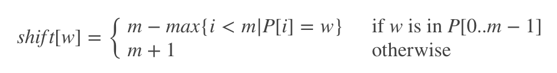

## 参考资料

1. [leetcode 初级算法](https://leetcode-cn.com/leetbook/detail/top-interview-questions-easy/)
2. [实现 strStr()](https://leetcode-cn.com/problems/implement-strstr/description/)


## 实现 strStr() 函数。

给定一个 `haystack` 字符串和一个 `needle` 字符串，在 `haystack` 字符串中找出 `needle` 字符串出现的第一个位置 (从0开始)。如果不存在，则返回  `-1`。

### 示例 1:
```bash
输入: haystack = "hello", needle = "ll"
输出: 2
```
### 示例 2:
```bash
输入: haystack = "aaaaa", needle = "bba"
输出: -1
```
### 说明:

当 `needle` 是空字符串时，我们应当返回什么值呢？这是一个在面试中很好的问题。

对于本题而言，当 `needle` 是空字符串时我们应当返回 `0` 


## 概述
这道题是要在 `haystack` 字符串中找到 `needle` 字符串。下面会给出的三种解法，这三种解法都基于滑动窗口。

子串逐一比较的解法最简单，将长度为 L 的滑动窗口沿着 hay`stack 字符串逐步移动，并将窗口内的子串与 needle 字符串相比较，时间复杂度为 $O((N−L)L)$

显示上面这个方法是可以优化的。双指针方法虽然也是线性时间复杂度，不过它可以避免比较所有的子串，因此最优情况下的时间复杂度为 $O(N)$，但最坏情况下的时间复杂度依然为 $O((N - L)L)$。

有 $O(N)$ 复杂度的解法嘛？答案是有的，有两种方法可以实现：

- Rabin-Karp，通过哈希算法实现常数时间窗口内字符串比较。
- 比特位操作，通过比特掩码来实现常数时间窗口内字符串比较。


## 方法一：子串逐一比较 - 线性时间复杂度
最直接的方法 - 沿着字符换逐步移动滑动窗口，将窗口内的子串与 needle 字符串比较。


### 代码
```js
/**
 * @param {string} haystack
 * @param {string} needle
 * @return {number}
 */
var strStr = function(haystack, needle) {
    let subLength = needle.length;
    if(subLength === 0 ) return 0;
    for(let i = 0;i<=haystack.length - subLength; i++){
        if(needle === haystack.substr(i,subLength)){
            return  i;
        }
    }
    return -1;

};
```


### 复杂度分析

- 时间复杂度：$O((N - L)$，其中 N 为 haystack 字符串的长度，L 为 needle 字符串的长度。内循环中比较字符串的复杂度为 L，总共需要比较 (N - L) 次。
- 空间复杂度：$O(1)$。


## 方法二：双指针 - 线性时间复杂度
上一个方法的缺陷是会将 `haystack` 所有长度为 L 的子串都与 `needle` 字符串比较，实际上是不需要这么做的。

只有子串的第一个字符跟 `needle` 字符串第一个字符相同的时候才需要比较。
### 代码
```js
/**
 * @param {string} haystack
 * @param {string} needle
 * @return {number}
 */
var strStr = function(haystack, needle) {
    let subLength = needle.length;
    if(subLength === 0 ) return 0;
    for(let i = 0;i<=haystack.length - subLength; i++){
        if(haystack[i] === needle[0]) {
            if(needle === haystack.substr(i,subLength)){
            return  i;
        }
      }
    }
    return -1;
};
```

### 复杂度分析
- 时间复杂度：最坏时间复杂度为 $O((N - L)L)$，最优时间复杂度为 $O(N)$。
- 空间复杂度：$O(1)$。

## 方法三： Rabin Karp - 常数复杂度
有一种最坏时间复杂度也为 $O(N)$ 的算法。思路是这样的，先生成窗口内子串的哈希码，然后再跟 `needle` 字符串的哈希码做比较。

这个思路有一个问题需要解决，如何在常数时间生成子串的哈希码？


### 滚动哈希：常数时间生成哈希码
生成一个长度为 L 数组的哈希码，需要 $O(L)$ 时间。

>如何在常数时间生成滑动窗口数组的哈希码？利用滑动窗口的特性，每次滑动都有一个元素进，一个出。


由于只会出现小写的英文字母，因此可以将字符串转化成值为 0 到 25 的整数数组： `arr[i] = (int)S.charAt(i) - (int)'a'`。按照这种规则，`abcd` 整数数组形式就是 `[0, 1, 2, 3]`，转换公式如下所示。

$$h0=0×26^3+1×26^2+2×26^1+3×26^0$$

可以将上面的公式写成通式，如下所示。其中 $c_i$ 为整数数组中的元素，$a = 26$，其为字符集的个数。

$$h_0=c_0a^{L−1} + c_1a^{L−2} +...+c_ia^{L−1−i}+...+c_{L−1}a^1+c_La^0$$
 

$$h_0 = \sum_{i = 0}^{L - 1}{c_i a^{L - 1 - i}}$$

下面来考虑窗口从 `abcd` 滑动到 `bcde` 的情况。这时候整数形式数组从 `[0, 1, 2, 3]` 变成了 `[1, 2, 3, 4]`，数组最左边的 `0` 被移除，同时最右边新添了 `4`。滑动后数组的哈希值可以根据滑动前数组的哈希值来计算，计算公式如下所示。


$$h_1=(h_0 − 0×26^3)×26 + 4×26^0$$

写成通式如下所示。

$$h_1 = (h_0 a - c_0 a^L) + c_{L + 1}$$


### 如何避免溢出
$a^L$ 可能是一个很大的数字，因此需要设置数值上限来避免溢出。设置数值上限可以用取模的方式，即用 h % modulus 来代替原本的哈希值。

理论上，`modules` 应该取一个很大数，但具体应该取多大的数呢? [详见这篇文章](https://en.wikipedia.org/wiki/Linear_congruential_generator#Parameters_in_common_use)，对于这个问题来说 $2^{31}$  就足够了。

### 算法
- 计算子字符串 `haystack.substring(0, L)` 和 `needle.substring(0, L)` 的哈希值。
- 从起始位置开始遍历：从第一个字符遍历到第 `N - L` 个字符。
  - 根据前一个哈希值计算滚动哈希。
  - 如果子字符串哈希值与 `needle` 字符串哈希值相等，返回滑动窗口起始位置。
- 返回 `-1`，这时候 `haystack` 字符串中不存在 `needle` 字符串。

### 实现
```js
/**
 * @param {string} haystack
 * @param {string} needle
 * @return {number}
 */
var strStr = function(haystack, needle) {
    let subLength = needle.length;
    // 生成hash值
    if(subLength === 0) return 0;
    if(subLength > haystack.length ) return -1;
    let h0 = 0;
    let h1=0;
    let module = Math.pow(2,31)
    for(let i=0;i<subLength;i++){
        let tempCode = needle.charCodeAt(i) - 97
        h0 = (h0 + tempCode*Math.pow(26,subLength-i-1))%module
        tempCode = haystack.charCodeAt(i) - 97
        h1 = (h1 + tempCode*Math.pow(26,subLength-i-1))%module
    }
    if(h0 === h1) return 0;
    let mathL = Math.pow(26,subLength) % module;
    for(let i=1;i<=haystack.length - subLength;i++){
        let oldCode = haystack.charCodeAt(i-1) - 97;
        let newCode = haystack.charCodeAt(i + subLength - 1) -97;
        h1 = ((h1*26 - oldCode*mathL) + newCode)%module
        if(h1 === h0 ) return i;
    }
    return -1;
};
```

### 复杂度分析
- 时间复杂度：$O(N)$，计算 needle 字符串的哈希值需要 $O(L)$ 时间，之后需要执行 $(N - L)$ 次循环，每次循环的计算复杂度为常数。
- 空间复杂度：$O(1)$


## 解法四: Sunday解法
### 一、Sunday 匹配机制
匹配机制非常容易理解:
- 目标字符串`String`
- 模式串 `Pattern`
- 当前查询索引 `idx` （初始为 00）
- 待匹配字符串 `str_cut : String [ idx : idx + len(Pattern) ]`

每次匹配都会从 **目标字符串中** 提取 **待匹配字符串** 与 **模式串** 进行匹配：
- 若匹配，则返回当前 `idx`
- 不匹配，则查看 **待匹配字符串** 的后一位字符 c：
    1. 若c存在于`Pattern`中，则 `idx = idx + 偏移表[c]`
    2. 否则，`idx = idx + len(pattern)`

Repeat Loop 直到 `idx + len(pattern) > len(String)`

### 二、偏移表
偏移表的作用是存储每一个在 **模式串** 中出现的字符，在 **模式串** 中出现的最右位置到尾部的距离 +1+1，例如 aab：

- a 的偏移位就是 `len(pattern)-1 = 2`
- b 的偏移位就是 `len(pattern)-2 = 1`
- 其他的均为 `len(pattern)+1 = 4`

综合一下：



### 三、举例
String: `checkthisout`

Pattern: `this`

#### step1


- $idx = 0$
- 待匹配字符串为：`chec`
- 因为 `chec != this`
- 所以查看 `chec` 的下一个字符 `k`
- `k` 不在 `Pattern` 里
- 所以查看 偏移表，`idx = idx + 5`

#### step2


- `idx=5`
- 待匹配字符串为：`this`
- 因为 `this == this` 
- 匹配，所以返回 5


### 代码
```js

```
### 算法分析
- 最坏情况：$O(nm)$
- 平均情况：$O(n)$
## 解法五: KMP解法
