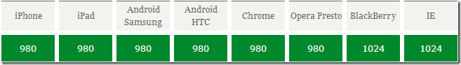
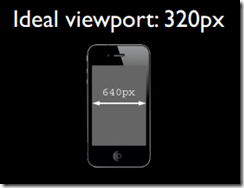
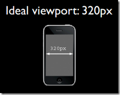
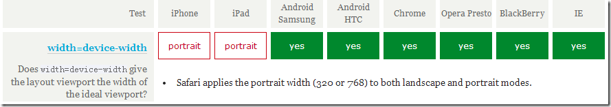
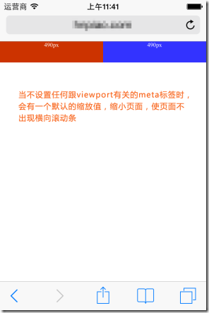

## 参考资料

1. [前端面试每日 3+1](https://github.com/haizlin/fe-interview/blob/master/category/history.md)
2. [Daily-Interview-Question 第九题](https://github.com/Advanced-Frontend/Daily-Interview-Question/issues/156)
3. [移动前端开发之 viewport 的深入理解](https://www.cnblogs.com/2050/p/3877280.html)
4. [CSS 的值与单位 mdn 文档](https://developer.mozilla.org/zh-CN/docs/Learn/CSS/Building_blocks/Values_and_units)
5. [Async/Await 如何通过同步的方式实现异步 蝈蝈 2010](https://juejin.im/post/5d2c814c6fb9a07ecd3d8e43)

## [html] viewport 常见设置都有哪些？

### 一、viewport 的概念

通俗的讲，移动设备上的 viewport 就是设备的屏幕上能用来显示我们的网页的那一块区域，在具体一点，就是浏览器上(也可能是一个 app 中的 webview)用来显示网页的那部分区域，但 viewport 又不局限于浏览器可视区域的大小，它可能比浏览器的可视区域要大，也可能比浏览器的可视区域要小。在默认情况下，一般来讲，移动设备上的 viewport 都是要大于浏览器可视区域的，这是因为考虑到移动设备的分辨率相对于桌面电脑来说都比较小，所以为了能在移动设备上正常显示那些传统的为桌面浏览器设计的网站，移动设备上的浏览器都会把自己默认的 viewport 设为 980px 或 1024px（也可能是其它值，这个是由设备自己决定的），但带来的后果就是浏览器会出现横向滚动条，因为浏览器可视区域的宽度是比这个默认的 viewport 的宽度要小的。下图列出了一些设备上浏览器的默认 viewport 的宽度。



### 二、css 中的 1px 并不等于设备的 1px

在 css 中我们一般使用 px 作为单位，在桌面浏览器中 css 的 1 个像素往往都是对应着电脑屏幕的 1 个物理像素，这可能会造成我们的一个错觉，那就是 css 中的像素就是设备的物理像素。但实际情况却并非如此，css 中的像素只是一个抽象的单位，在不同的设备或不同的环境中，css 中的 1px 所代表的设备物理像素是不同的。在为桌面浏览器设计的网页中，我们无需对这个津津计较，但在移动设备上，必须弄明白这点。在早先的移动设备中，屏幕像素密度都比较低，如 iphone3，它的分辨率为 320x480，在 iphone3 上，一个 css 像素确实是等于一个屏幕物理像素的。后来随着技术的发展，移动设备的屏幕像素密度越来越高，从 iphone4 开始，苹果公司便推出了所谓的 Retina 屏，分辨率提高了一倍，变成 640x960，但屏幕尺寸却没变化，这就意味着同样大小的屏幕上，像素却多了一倍，这时，一个 css 像素是等于两个物理像素的。其他品牌的移动设备也是这个道理。例如安卓设备根据屏幕像素密度可分为 ldpi、mdpi、hdpi、xhdpi 等不同的等级，分辨率也是五花八门，安卓设备上的一个 css 像素相当于多少个屏幕物理像素，也因设备的不同而不同，没有一个定论。

还有一个因素也会引起 css 中 px 的变化，那就是用户缩放。例如，当用户把页面放大一倍，那么 css 中 1px 所代表的物理像素也会增加一倍；反之把页面缩小一倍，css 中 1px 所代表的物理像素也会减少一倍。关于这点，在文章后面的部分还会讲到。

在移动端浏览器中以及某些桌面浏览器中，window 对象有一个 devicePixelRatio 属性，它的官方的定义为：设备物理像素和设备独立像素的比例，也就是 devicePixelRatio = 物理像素 / 独立像素。css 中的 px 就可以看做是设备的独立像素，所以通过 devicePixelRatio，我们可以知道该设备上一个 css 像素代表多少个物理像素。例如，在 Retina 屏的 iphone 上，devicePixelRatio 的值为 2，也就是说 1 个 css 像素相当于 2 个物理像素。但是要注意的是，devicePixelRatio 在不同的浏览器中还存在些许的兼容性问题，所以我们现在还并不能完全信赖这个东西，具体的情况可以看下[这篇文章](http://www.quirksmode.org/blog/archives/2012/06/devicepixelrati.html)。

devicePixelRatio 的测试结果：


### 三、PPK 的关于三个 viewport 的理论

[ppk 大神](http://www.quirksmode.org/)对于移动设备上的 viewport 有着非常多的研究（[第一篇](http://www.quirksmode.org/mobile/viewports.html)，[第二篇](http://www.quirksmode.org/mobile/viewports2.html)，[第三篇](http://www.quirksmode.org/mobile/metaviewport/)），有兴趣的同学可以去看一下，本文中有很多数据和观点也是出自那里。ppk 认为，移动设备上有三个 viewport。

首先，移动设备上的浏览器认为自己必须能让所有的网站都正常显示，即使是那些不是为移动设备设计的网站。但如果以浏览器的可视区域作为 viewport 的话，因为移动设备的屏幕都不是很宽，所以那些为桌面浏览器设计的网站放到移动设备上显示时，必然会因为移动设备的 viewport 太窄，而挤作一团，甚至布局什么的都会乱掉。也许有人会问，现在不是有很多手机分辨率都非常大吗，比如 768x1024，或者 1080x1920 这样，那这样的手机用来显示为桌面浏览器设计的网站是没问题的吧？前面我们已经说了，css 中的 1px 并不是代表屏幕上的 1px，你分辨率越大，css 中 1px 代表的物理像素就会越多，devicePixelRatio 的值也越大，这很好理解，因为你分辨率增大了，但屏幕尺寸并没有变大多少，必须让 css 中的 1px 代表更多的物理像素，才能让 1px 的东西在屏幕上的大小与那些低分辨率的设备差不多，不然就会因为太小而看不清。所以在 1080x1920 这样的设备上，在默认情况下，也许你只要把一个 div 的宽度设为 300 多 px（视 devicePixelRatio 的值而定），就是满屏的宽度了。回到正题上来，如果把移动设备上浏览器的可视区域设为 viewport 的话，某些网站就会因为 viewport 太窄而显示错乱，所以这些浏览器就决定默认情况下把 viewport 设为一个较宽的值，比如 980px，这样的话即使是那些为桌面设计的网站也能在移动浏览器上正常显示了。ppk 把这个浏览器默认的 viewport 叫做 **layout viewport**。这个 layout viewport 的宽度可以通过 `document.documentElement.clientWidth` 来获取。

然而，**layout viewport** 的宽度是大于浏览器可视区域的宽度的，所以我们还需要一个 viewport 来代表 浏览器可视区域的大小，ppk 把这个 viewport 叫做 **visual viewport**。visual viewport 的宽度可以通过`window.innerWidth` 来获取，但在 Android 2, Oprea mini 和 UC 8 中无法正确获取。


现在我们已经有两个 viewport 了：**layout viewport** 和 **visual viewport**。但浏览器觉得还不够，因为现在越来越多的网站都会为移动设备进行单独的设计，所以必须还要有一个能完美适配移动设备的 viewport。所谓的完美适配指的是，首先不需要用户缩放和横向滚动条就能正常的查看网站的所有内容；第二，显示的文字的大小是合适，比如一段 14px 大小的文字，不会因为在一个高密度像素的屏幕里显示得太小而无法看清，理想的情况是这段 14px 的文字无论是在何种密度屏幕，何种分辨率下，显示出来的大小都是差不多的。当然，不只是文字，其他元素像图片什么的也是这个道理。ppk 把这个 viewport 叫做 **ideal viewport**，也就是第三个 viewport——移动设备的理想 viewport。

ideal viewport 并没有一个固定的尺寸，不同的设备拥有有不同的 ideal viewport。所有的 iphone 的 ideal viewport 宽度都是 320px，无论它的屏幕宽度是 320 还是 640，也就是说，在 iphone 中，css 中的 320px 就代表 iphone 屏幕的宽度。



但是安卓设备就比较复杂了，有 320px 的，有 360px 的，有 384px 的等等，关于不同的设备 ideal viewport 的宽度都为多少，可以到http://viewportsizes.com去查看一下，里面收集了众多设备的理想宽度。

再总结一下：ppk 把移动设备上的 viewport 分为 layout viewport 、 visual viewport 和 ideal viewport 三类，其中的 ideal viewport 是最适合移动设备的 viewport，ideal viewport 的宽度等于移动设备的屏幕宽度，只要在 css 中把某一元素的宽度设为 ideal viewport 的宽度(单位用 px)，那么这个元素的宽度就是设备屏幕的宽度了，也就是宽度为 100%的效果。ideal viewport 的意义在于，无论在何种分辨率的屏幕下，那些针对 ideal viewport 而设计的网站，不需要用户手动缩放，也不需要出现横向滚动条，都可以完美的呈现给用户。

### 四、利用 meta 标签对 viewport 进行控制

移动设备默认的 viewport 是 layout viewport，也就是那个比屏幕要宽的 viewport，但在进行移动设备网站的开发时，我们需要的是 ideal viewport。那么怎么才能得到 ideal viewport 呢？这就该轮到 meta 标签出场了。

我们在开发移动设备的网站时，最常见的的一个动作就是把下面这个东西复制到我们的 head 标签中：

```html
<meta
  name="viewport"
  content="width=device-width, initial-scale=1.0, maximum-scale=1.0, user-scalable=0"
/>
```

该 meta 标签的作用是让当前 viewport 的宽度等于设备的宽度，同时不允许用户手动缩放。也许允不允许用户缩放不同的网站有不同的要求，但让 viewport 的宽度等于设备的宽度，这个应该是大家都想要的效果，如果你不这样的设定的话，那就会使用那个比屏幕宽的默认 viewport，也就是说会出现横向滚动条。

这个 name 为 viewport 的 meta 标签到底有哪些东西呢，又都有什么作用呢？

meta viewport 标签首先是由苹果公司在其 safari 浏览器中引入的，目的就是解决移动设备的 viewport 问题。后来安卓以及各大浏览器厂商也都纷纷效仿，引入对 meta viewport 的支持，事实也证明这个东西还是非常有用的。

在苹果的规范中，meta viewport 有 6 个属性(暂且把 content 中的那些东西称为一个个属性和值)，如下：
属性|解释
--|--
width |设置 layout viewport 的宽度，为一个正整数，或字符串"width-device"
initial-scale |设置页面的初始缩放值，为一个数字，可以带小数
minimum-scale |允许用户的最小缩放值，为一个数字，可以带小数
maximum-scale |允许用户的最大缩放值，为一个数字，可以带小数
height |设置 layout viewport 的高度，这个属性对我们并不重要，很少使用
user-scalable 是否允许用户进行缩放，值为"no"或"yes", no 代表不允许，yes 代表允许

这些属性可以同时使用，也可以单独使用或混合使用，多个属性同时使用时用逗号隔开就行了。

此外，在安卓中还支持 target-densitydpi 这个私有属性，它表示目标设备的密度等级，作用是决定 css 中的 1px 代表多少物理像素

| 属性              | 解释                                                                                  |
| ----------------- | ------------------------------------------------------------------------------------- |
| target-densitydpi | 值可以为一个数值或 high-dpi 、 medium-dpi、 low-dpi、 device-dpi 这几个字符串中的一个 |

特别说明的是，当 target-densitydpi=device-dpi 时， css 中的 1px 会等于物理像素中的 1px。

因为这个属性只有安卓支持，并且安卓已经决定要废弃 target-densitydpi 这个属性了，所以这个属性我们要避免进行使用。

### 五、把当前的 viewport 宽度设置为 ideal viewport 的宽度

要得到 ideal viewport 就必须把默认的 layout viewport 的宽度设为移动设备的屏幕宽度。因为 meta viewport 中的 width 能控制 layout viewport 的宽度，所以我们只需要把 width 设为 width-device 这个特殊的值就行了。

```html
<meta name="viewport" content="width=device-width" />
```

下图是这句代码在各大移动端浏览器上的测试结果：


可以看到通过 width=device-width，所有浏览器都能把当前的 viewport 宽度变成 ideal viewport 的宽度，但要注意的是，在 iphone 和 ipad 上，无论是竖屏还是横屏，宽度都是竖屏时 ideal viewport 的宽度。

这样的写法看起来谁都会做，没吃过猪肉，谁还没见过猪跑啊~，确实，我们在开发移动设备上的网页时，不管你明不明白什么是 viewport，可能你只需要这么一句代码就够了。

可是你肯定不知道

```html
<meta name="viewport" content="initial-scale=1" />
```

这句代码也能达到和前一句代码一样的效果，也可以把当前的的 viewport 变为 ideal viewport。

呵呵，傻眼了吧，因为从理论上来讲，这句代码的作用只是不对当前的页面进行缩放，也就是页面本该是多大就是多大。那为什么会有 `width=device-width` 的效果呢？

要想清楚这件事情，首先你得弄明白这个缩放是相对于什么来缩放的，因为这里的缩放值是 1，也就是没缩放，但却达到了 ideal viewport 的效果，所以，那答案就只有一个了，缩放是相对于 ideal viewport 来进行缩放的，当对 ideal viewport 进行 100%的缩放，也就是缩放值为 1 的时候，不就得到了 ideal viewport 吗？事实证明，的确是这样的。下图是各大移动端的浏览器当设置了`<meta name="viewport" content="initial-scale=1">` 后是否能把当前的 viewport 宽度变成 ideal viewport 的宽度的测试结果


测试结果表明 initial-scale=1 也能把当前的 viewport 宽度变成 ideal viewport 的宽度，但这次轮到了 windows phone 上的 IE 无论是竖屏还是横屏都把宽度设为竖屏时 ideal viewport 的宽度。但这点小瑕疵已经无关紧要了。

但如果 width 和 initial-scale=1 同时出现，并且还出现了冲突呢？比如：

```html
<meta name="viewport" content="width=400, initial-scale=1" />
```

width=400 表示把当前 viewport 的宽度设为 400px，initial-scale=1 则表示把当前 viewport 的宽度设为 ideal viewport 的宽度，那么浏览器到底该服从哪个命令呢？是书写顺序在后面的那个吗？不是。当遇到这种情况时，浏览器会取它们两个中较大的那个值。例如，当 width=400，ideal viewport 的宽度为 320 时，取的是 400；当 width=400， ideal viewport 的宽度为 480 时，取的是 ideal viewport 的宽度。（ps:在 uc9 浏览器中，当 initial-scale=1 时，无论 width 属性的值为多少，此时 viewport 的宽度永远都是 ideal viewport 的宽度）

最后，总结一下，要把当前的 viewport 宽度设为 ideal viewport 的宽度，既可以设置 width=device-width，也可以设置 initial-scale=1，但这两者各有一个小缺陷，就是 iphone、ipad 以及 IE 会横竖屏不分，通通以竖屏的 ideal viewport 宽度为准。所以，最完美的写法应该是，两者都写上去，这样就 initial-scale=1 解决了 iphone、ipad 的毛病，width=device-width 则解决了 IE 的毛病：

```html
<meta name="viewport" content="width=device-width, initial-scale=1" />
```

### 六、关于 meta viewport 的更多知识

#### 1、关于缩放以及 initial-scale 的默认值

首先我们先来讨论一下缩放的问题，前面已经提到过，缩放是相对于 ideal viewport 来缩放的，缩放值越大，当前 viewport 的宽度就会越小，反之亦然。例如在 iphone 中，ideal viewport 的宽度是 320px，如果我们设置 initial-scale=2 ，此时 viewport 的宽度会变为只有 160px 了，这也好理解，放大了一倍嘛，就是原来 1px 的东西变成 2px 了，但是 1px 变为 2px 并不是把原来的 320px 变为 640px 了，而是在实际宽度不变的情况下，1px 变得跟原来的 2px 的长度一样了，所以放大 2 倍后原来需要 320px 才能填满的宽度现在只需要 160px 就做到了。因此，我们可以得出一个公式：

```
visual viewport宽度 = ideal viewport宽度  / 当前缩放值

当前缩放值 = ideal viewport宽度  / visual viewport宽度
```

ps: visual viewport 的宽度指的是浏览器可视区域的宽度。

大多数浏览器都符合这个理论，但是安卓上的原生浏览器以及 IE 有些问题。安卓自带的 webkit 浏览器只有在 initial-scale = 1 以及没有设置 width 属性时才是表现正常的，也就相当于这理论在它身上基本没用；而 IE 则根本不甩 initial-scale 这个属性，无论你给他设置什么，initial-scale 表现出来的效果永远是 1。

好了，现在再来说下 initial-scale 的默认值问题，就是不写这个属性的时候，它的默认值会是多少呢？很显然不会是 1，因为当 initial-scale = 1 时，当前的 layout viewport 宽度会被设为 ideal viewport 的宽度，但前面说了，各浏览器默认的 layout viewport 宽度一般都是 980 啊，1024 啊，800 啊等等这些个值，没有一开始就是 ideal viewport 的宽度的，所以 initial-scale 的默认值肯定不是 1。安卓设备上的 initial-scale 默认值好像没有方法能够得到，或者就是干脆它就没有默认值，一定要你显示的写出来这个东西才会起作用，我们不管它了，这里我们重点说一下 iphone 和 ipad 上的 initial-scale 默认值。

根据测试，我们可以在 iphone 和 ipad 上得到一个结论，就是无论你给 layout viewpor 设置的宽度是多少，而又没有指定初始的缩放值的话，那么 iphone 和 ipad 会自动计算 initial-scale 这个值，以保证当前 layout viewport 的宽度在缩放后就是浏览器可视区域的宽度，也就是说不会出现横向滚动条。比如说，在 iphone 上，我们不设置任何的 viewport meta 标签，此时 layout viewport 的宽度为 980px，但我们可以看到浏览器并没有出现横向滚动条，浏览器默认的把页面缩小了。根据上面的公式，当前缩放值 = ideal viewport 宽度 / visual viewport 宽度，我们可以得出：

    当前缩放值 = 320 / 980

也就是当前的 initial-scale 默认值应该是 0.33 这样子。当你指定了 initial-scale 的值后，这个默认值就不起作用了。

总之记住这个结论就行了：在 iphone 和 ipad 上，无论你给 viewport 设的宽的是多少，如果没有指定默认的缩放值，则 iphone 和 ipad 会自动计算这个缩放值，以达到当前页面不会出现横向滚动条(或者说 viewport 的宽度就是屏幕的宽度)的目的。



#### 2、动态改变 meta viewport 标签

第一种方法

可以使用 document.write 来动态输出 meta viewport 标签，例如：

```js
document.write(
  '<meta name="viewport" content="width=device-width,initial-scale=1">'
)
```

第二种方法

通过 setAttribute 来改变

```js
<meta id="testViewport" name="viewport" content="width = 380">
<script>
var mvp = document.getElementById('testViewport');
mvp.setAttribute('content','width=480');
</script>
```

### 七、结语

说了那么多废话，最后还是有必要总结一点有用的出来。

首先如果不设置 meta viewport 标签，那么移动设备上浏览器默认的宽度值为 800px，980px，1024px 等这些，总之是大于屏幕宽度的。这里的宽度所用的单位 px 都是指 css 中的 px，它跟代表实际屏幕物理像素的 px 不是一回事。

第二、每个移动设备浏览器中都有一个理想的宽度，这个理想的宽度是指 css 中的宽度，跟设备的物理宽度没有关系，在 css 中，这个宽度就相当于 100%的所代表的那个宽度。我们可以用 meta 标签把 viewport 的宽度设为那个理想的宽度，如果不知道这个设备的理想宽度是多少，那么用 device-width 这个特殊值就行了，同时 initial-scale=1 也有把 viewport 的宽度设为理想宽度的作用。所以，我们可以使用

```html
<meta name="viewport" content="width=device-width, initial-scale=1" />
```

来得到一个理想的 viewport（也就是前面说的 ideal viewport）。

为什么需要有理想的 viewport 呢？比如一个分辨率为 320x480 的手机理想 viewport 的宽度是 320px，而另一个屏幕尺寸相同但分辨率为 640x960 的手机的理想 viewport 宽度也是为 320px，那为什么分辨率大的这个手机的理想宽度要跟分辨率小的那个手机的理想宽度一样呢？这是因为，只有这样才能保证同样的网站在不同分辨率的设备上看起来都是一样或差不多的。实际上，现在市面上虽然有那么多不同种类不同品牌不同分辨率的手机，但它们的理想 viewport 宽度归纳起来无非也就 320、360、384、400 等几种，都是非常接近的，理想宽度的相近也就意味着我们针对某个设备的理想 viewport 而做出的网站，在其他设备上的表现也不会相差非常多甚至是表现一样的。

## [css] 对比下 px、em、rem 有什么不同？

### 绝对长度单位

以下都是**绝对**长度单位——它们与其他任何东西都没有关系，通常被认为总是相同的大小。
单位 |名称 |等价换算
--|--|--
cm |厘米 |1cm = 96px/2.54
mm |毫米 |1mm = 1/10th of 1cm
Q |四分之一毫米 |1Q = 1/40th of 1cm
in |英寸 |1in = 2.54cm = 96px
pc |十二点活字 |1pc = 1/16th of 1in
pt |点 |1pt = 1/72th of 1in
px |像素 |1px = 1/96th of 1in

这些值中的大多数在用于打印时比用于屏幕输出时更有用。例如，我们通常不会在屏幕上使用 cm。惟一一个您经常使用的值，估计就是 px(像素)。

### 相对长度单位

相对长度单位相对于其他一些东西，比如父元素的字体大小，或者视图端口的大小。使用相对单位的好处是，经过一些仔细的规划，您可以使文本或其他元素的大小与页面上的其他内容相对应。下表列出了 web 开发中一些最有用的单位。

| 单位 | 相对于                                                                                          |
| ---- | ----------------------------------------------------------------------------------------------- |
| em   | 在 `font-size` 中使用是相对于父元素的字体大小，在其他属性中使用是相对于自身的字体大小，如 width |
| ex   | 字符“x”的高度                                                                                   |
| ch   | 数字“0”的宽度                                                                                   |
| rem  | 根元素的字体大小                                                                                |
| lh   | 元素的 line-height                                                                              |
| vw   | 视窗宽度的 1%                                                                                   |
| vh   | 视窗高度的 1%                                                                                   |
| vmin | 视窗较小尺寸的 1%                                                                               |
| vmax | 视图大尺寸的 1%                                                                                 |

### 总结

- px:绝对长度单位
- em:概括地说，在排版属性中 em 单位的意思是“父元素的字体大小”。
- rem:概括地说，rem 单位的意思是“根元素的字体大小”。

## [js] 简要描述下什么是回调函数并写一个例子出来

**回调**是把一个函数作为参数传递给另一个函数，当该函数满足某个条件时触发该参数函数。

主要用于异步操作 例如网络请求 防止页面同步代码阻塞导致渲染线程停止

```js
function longTask(callback, timeout) {
  setTimeout(callback, timeout)
}
longTask(() => {
  console.log('回调任务被执行了')
}, 2000)
console.log('我是同步代码 不会阻塞我')
```

## Async/Await 如何通过同步的方式实现异步

### 阮一峰大神的教程

Async/Await 就是一个自执行的 generate 函数。利用 generate 函数的特性把异步的代码写成“同步”的形式。

```js
var fetch = require('node-fetch')

function* gen() {
  // 这里的*可以看成 async
  var url = 'https://api.github.com/users/github'
  var result = yield fetch(url) // 这里的yield可以看成 await
  console.log(result.bio)
}
```

```js
var g = gen()
var result = g.next()

result.value
  .then(function(data) {
    return data.json()
  })
  .then(function(data) {
    g.next(data)
  })
```

[具体见这里](http://es6.ruanyifeng.com/#docs/generator-async)

### Async/Await 如何通过同步的方式实现异步

作为前端人员要回答这个问题，需要了解这三个知识点：

- 同步
- 异步
- Async/Await

首先，**js 是单线程的（重复三遍）**，所谓单线程，
通俗的讲就是，一根筋（比喻有点过分，哈哈）执行代码是一行一行的往下走（即所谓的同步），
如果上面的没执行完，就痴痴的等着（是不是很像恋爱中在路边等她/他的你，假装 new 了个对象，啊哈哈哈，调皮一下很开心），
还是举个 🌰 吧：

```js
// chrome 75
function test() {
  let d = Date.now()
  for (let i = 0; i < 1e8; i++) {}
  console.log(Date.now() - d) // 62ms左右
}
function test1() {
  let d = Date.now()

  console.log(Date.now() - d) // 0
}
test()
test1()
```

上面仅仅是一个 for 循环，而在实际应用中，会有大量的网络请求，它的响应时间是不确定的，这种情况下也要痴痴的等么？显然是不行的，因而 js 设计了异步，即 发起网络请求（诸如 IO 操作，定时器），由于需要等服务器响应，就先不理会，而是去做其他的事儿，等请求返回了结果的时候再说（即异步）。
那么如何实现异步呢？其实我们平时已经在大量使用了，那就是 `callback`，例如：

```js
$.ajax({
  url: 'http://xxx',
  success: function(res) {
    console.log(res)
  },
})
```

success 作为函数传递过去并不会立即执行，而是等请求成功了才执行，即**回调函数（callback）**

```js
const fs = require('fs')
fs.rename('旧文件.txt', '新文件.txt', (err) => {
  if (err) throw err
  console.log('重命名完成')
})
```

和网络请求类似，等到 IO 操作有了结果（无论成功与否）才会执行第三个参数：`(err)=>{}`

从上面我们就可以看出，实现异步的核心就是回调钩子，将 cb 作为参数传递给异步执行函数，当有了结果后在触发 cb。想了解更多，去看看 `event-loop` 机制吧。

至于 `async/await` 是如何出现的呢，在 es6 之前，大多 js 数项目中会有类似这样的代码：

```js
ajax1(url, () => {
  ajax2(url, () => {
    ajax3(url, () => {
      // do something
    })
  })
})
```

这种函数嵌套，大量的回调函数，使代码阅读起来晦涩难懂，不直观，形象的称之为**回调地狱（callback hell）**，所以为了在写法上能更通俗一点，es6+陆续出现了 Promise、Generator、Async/await，力求在写法上简洁明了，可读性强。

async/await 是参照 `Generator` 封装的一套异步处理方案，可以理解为 `Generator` 的语法糖，

所以了解 async/await 就不得不讲一讲 Generator,而 Generator 又依赖于迭代器 Iterator，所以就得先讲一讲 Iterator,而 Iterator 的思想呢又来源于单向链表，

终于找到源头了：单向链表

#### 1. 单向链表

> wiki：链表（Linked list）是一种常见的基础数据结构，是一种线性表，但是并不会按线性的顺序储存数据，而是在每一个节点里存到下一个节点的指针（Pointer）。由于不必须按顺序储存，链表在插入的时候可以达到 o(1)的复杂度，比另一种线性表顺序表快得多，但是查找一个节点或者访问特定编号的节点则需要 o(n)的时间，而顺序表响应的时间复杂度分别是 o(logn)和 o(1)。

总结一下链表优点：

- 无需预先分配内存
- 插入/删除节点不影响其他节点，效率高（典型的例子：git commit、dom 操作）

单向链表：是链表中最简单的一种，它包含两个域，一个信息域和一个指针域。这个链接指向列表中的下一个节点，而最后一个节点则指向一个空值。


一个单向链表包含两个值: 当前节点的值和一个指向下一个节点的链接

单链特点：节点的链接方向是单向的；相对于数组来说，单链表的的随机访问速度较慢，但是单链表删除/添加数据的效率很高。

那么如何设计一个单向链表呢？这个取决于我们需要哪些操作，通常有：

- append(element)：追加节点
- insert(element,index)：在索引位置插入节点
- remove(element)：删除第一个匹配到的节点
- removeAt(index)：删除指定索引节点
- removeAll(element)：删除所有匹配的节点
- get(index)：获取指定索引的节点信息
- set(element,index)：修改指定索引的节点值
- indexOf(element)：获取某节点的索引位置
- clear()：清除所有节点
- length()：返回节点长度
- printf()：打印节点信息

看到这些方法是不是有些许熟悉，当你用原生 js 或 jq 时常会用上面类似的方法，现在根据上面列出的方法进行实现一个单向链：

```js
// 节点模型
class LinkNode {
  constructor(element, next) {
    this.element = element
    this.next = next
  }
}

class LinkedList {
  constructor() {
    this._head = null
    this._size = 0
    this._errorBoundary = this._errorBoundary.bind(this)
    this._getNodeByIndex = this._getNodeByIndex.bind(this)
    this.append = this.append.bind(this)
    this.insert = this.insert.bind(this)
    this.remove = this.remove.bind(this)
    this.removeAt = this.removeAt.bind(this)
    this.removeAll = this.removeAll.bind(this)
    this.getElement = this.getElement.bind(this)
    this.setIndex = this.setIndex.bind(this)
    this.indexOf = this.indexOf.bind(this)
    this.clear = this.clear.bind(this)
    this.length = this.length.bind(this)
    this.printf = this.printf.bind(this)
  }

  // 边界检验
  _errorBoundary(index) {
    if (index < 0 || index >= this._size) {
      throw `超出边界(${0}~${this._size})，目标位置${index}不存在！`
    }
  }
  // 根据索引获取目标对象
  _getNodeByIndex(index) {
    this._errorBoundary(index)
    let obj = this._head
    for (let i = 0; i < index; i++) {
      obj = obj.next
    }
    return obj
  }
  // 追加节点
  append(element) {
    if (this._size === 0) {
      this._head = new LinkNode(element, null)
    } else {
      let obj = this._getNodeByIndex(this._size - 1)
      obj.next = new LinkNode(element, null)
    }
    this._size++
  }
  // 在索引位置插入节点
  insert(element, index) {
    if (index === 0) {
      this._head = new LinkNode(element, this._head)
    } else {
      let obj = this._getNodeByIndex(index - 1)
      obj.next = new LinkNode(element, obj.next)
    }
    this._size++
  }
  // 删除第一个匹配到的节点
  remove(element) {
    if (this._size < 1) return null

    if (this._head.element == element) {
      this._head.element = this._head.next
      this._size--
      return element
    } else {
      let temp = this._head
      while (temp.next) {
        if (temp.next.element == element) {
          temp.next = temp.next.next
          this._size--
          return element
        } else {
          temp = temp.next
        }
      }
    }
    return null
  }
  // 删除指定索引节点
  removeAt(index) {
    this._errorBoundary(index)
    let element = null
    if (index === 0) {
      element = this._head.element
      this._head = this._head.next
    } else {
      let prev = this._getNodeByIndex(index - 1)
      element = prev.next.element
      prev.next = prev.next.next
    }
    this._size--
    return element
  }
  // 删除所有匹配的节点
  removeAll(element) {
    // 创建虚拟头节点，
    let v_head = new LinkNode(null, this._head)
    let tempNode = v_head
    // let tempEle = null;
    while (tempNode.next) {
      if (tempNode.next.element == element) {
        tempNode.next = tempNode.next.next
        this._size--
        // tempEle = element;
      } else {
        tempNode = tempNode.next
      }
    }
    this._head = v_head.next
  }
  // 获取指定索引的节点信息
  getElement(index) {
    return this._getNodeByIndex(index).element
  }
  // 修改指定索引的节点值
  setIndex(element, index) {
    this._errorBoundary(index)
    let obj = this._getNodeByIndex(index)
    obj.element = element
  }
  // 获取某节点的索引位置
  indexOf(element) {
    let obj = this._head
    let index = -1
    for (let i = 0; i < this._size; i++) {
      if (obj.element == element) {
        index = i
        break
      }
      obj = obj.next
    }
    return index
  }
  // 清除所有节点
  clear() {
    this._head = null
    this._size = 0
  }
  // 返回节点长度
  length() {
    return this._size
  }
  // 打印节点信息
  printf() {
    let obj = this._head
    const arr = []
    while (obj != null) {
      arr.push(obj.element)
      obj = obj.next
    }
    const str = arr.join('->')
    return str || null
  }
}

const obj = new LinkedList()
obj.append(0)
obj.append(1)
obj.append(2)
obj.printf()
// "0->1->2"

obj.insert(3, 3)
obj.printf()
// "0->1->2->3"

obj.remove(3)
obj.printf()
// "0->1->2"

obj.removeAt(0)
obj.printf()
// "1->2"

obj.setIndex(0, 0)
obj.printf()
// "0->2"

obj.indexOf(2)
// 1

obj.length()
// 2

obj.clear()
obj.printf()
// null
```

[查看源码](https://github.com/Mr-jiangzhiguo/book/blob/master/code/linked.js)

通过以上，我假装你明白什么是单向链表，并且能够用代码实现一个单向链表了，下一步开始说一说**迭代器** `Iterator`

#### 2. Iterator

Iterator 翻译过来就是 **迭代器（遍历器）** 让我们先来看看它的遍历过程(类似于单向链表)：

- 创建一个**指针对象**，指向当前数据结构的起始位置
- 第一次调用指针对象的 `next` 方法，将指针指向数据结构的第一个成员
- 第二次调用指针对象的 `next` 方法，将指针指向数据结构的第二个成员
- 不断的调用指针对象的 `next` 方法，直到它指向数据结构的结束位置

一个对象要变成可迭代的，必须实现 `@@iterator`方法，即对象（或它原型链上的某个对象）必须有一个名字是 `Symbol.iterator` 的属性（原生具有该属性的有：字符串、数组、类数组的对象、Set 和 Map）：

| 属性               | 值                                               |
| ------------------ | ------------------------------------------------ |
| [Symbol.iterator]: | 返回一个对象的无参函数，被返回对象符合迭代器协议 |

当一个对象需要被迭代的时候（比如开始用于一个 `for..of` 循环中），它的 `@@iterator` 方法被调用并且无参数，然后返回一个用于在迭代中获得值的迭代器

迭代器协议：产生一个有限或无限序列的值，并且当所有的值都已经被迭代后，就会有一个默认的返回值

当一个对象只有满足下述条件才会被认为是一个迭代器：

它实现了一个 `next()` 的方法，该方法**必须返回一个对象**,对象有两个必要的属性：

- done（bool）
  - true：迭代器已经超过了可迭代次数。这种情况下,value 的值可以被省略
  - 如果迭代器可以产生序列中的下一个值，则为 false。这等效于没有指定 done 这个属性
- value 迭代器返回的任何 JavaScript 值。done 为 true 时可省略

根据上面的规则，咱们来自定义一个简单的迭代器

```js
const makeIterator = (arr) => {
  let nextIndex = 0
  return {
    next: () =>
      nextIndex < arr.length
        ? { value: arr[nextIndex++], done: false }
        : { value: undefined, done: true },
  }
}
const it = makeIterator(['人月', '神话'])
console.log(it.next()) // { value: "人月", done: false }
console.log(it.next()) // { value: "神话", done: false }
console.log(it.next()) // {value: undefined, done: true }
```

我们还可以自定义一个可迭代对象：

```js
const myIterable = {}
myIterable[Symbol.iterator] = function*() {
  yield 1
  yield 2
  yield 3
}

for (let value of myIterable) {
  console.log(value)
}
// 1
// 2
// 3

//or

console.log([...myIterable]) // [1, 2, 3]
```

了解了迭代器，下面可以进一步了解生成器了

#### 3. Generator

`Generator`：生成器对象是生成器函数（GeneratorFunction）返回的，它符合可迭代协议和迭代器协议，既是迭代器也是可迭代对象，可以调用 next 方法，但它不是函数，更不是构造函数
生成器函数（GeneratorFunction）：

> function\* name([param[, param[, ... param]]]) { statements }
>
> - name：函数名
> - param：参数
> - statements：js 语句

调用一个生成器函数并不会马上执行它里面的语句，而是返回一个这个生成器的迭代器对象，当这个迭代器的 `next()` 方法被首次（后续）调用时，其内的语句会执行到第一个（后续）出现 `yield` 的位置为止（让执行处于暂停状），`yield` 后紧跟迭代器要返回的值。或者如果用的是 `yield*`（多了个星号），则表示将执行权移交给另一个生成器函数（当前生成器暂停执行），调用 `next()` （再启动）方法时，如果传入了参数，那么这个参数会作为上一条执行的 yield 语句的返回值，例如：

```js
function* another() {
  yield '人月神话'
}
function* gen() {
  yield* another() // 移交执行权
  const a = yield 'hello'
  const b = yield a // a='world' 是 next('world') 传参赋值给了上一个 yidle 'hello' 的左值
  yield b // b=！ 是 next('！') 传参赋值给了上一个 yidle a 的左值
}
const g = gen()
g.next() // {value: "人月神话", done: false}
g.next() // {value: "hello", done: false}
g.next('world') // {value: "world", done: false} 将 'world' 赋给上一条 yield 'hello' 的左值，即执行 a='world'，
g.next('!') // {value: "!", done: false} 将 '!' 赋给上一条 yield a 的左值，即执行 b='!'，返回 b
g.next() // {value: undefined, done: false}
```

看到这里，你可能会问，`Generator` 和 `callback` 有啥关系，如何处理异步呢？其实二者没有任何关系，我们只是通过一些方式强行的它们产生了关系，才会有 `Generator` 处理异步

我们来总结一下 `Generator` 的本质，暂停，它会让程序执行到指定位置先暂停（yield），然后再启动（next），再暂停（yield），再启动（next），而这个暂停就很容易让它和异步操作产生联系，因为我们在处理异步时：开始异步处理（网络求情、IO 操作），然后暂停一下，等处理完了，再该干嘛干嘛。不过值得注意的是，js 是单线程的（又重复了三遍），异步还是异步，callback 还是 callback，不会因为 Generator 而有任何改变
下面来看看，用 Generator 实现异步：

```js
const promisify = require('util').promisify
const path = require('path')
const fs = require('fs')
const readFile = promisify(fs.readFile)

const gen = function*() {
  const res1 = yield readFile(path.resolve(__dirname, '../data/a.json'), {
    encoding: 'utf8',
  })
  console.log(res1)
  const res2 = yield readFile(path.resolve(__dirname, '../data/b.json'), {
    encoding: 'utf8',
  })
  console.log(res2)
}

const g = gen()

const g1 = g.next()
console.log('g1:', g1)

g1.value
  .then((res1) => {
    console.log('res1:', res1)
    const g2 = g.next(res1)
    console.log('g2:', g2)
    g2.value
      .then((res2) => {
        console.log('res2:', res2)
        g.next(res2)
      })
      .catch((err2) => {
        console.log(err2)
      })
  })
  .catch((err1) => {
    console.log(err1)
  })
// g1: { value: Promise { <pending> }, done: false }
// res1: {
//   "a": 1
// }

// {
//   "a": 1
// }

// g2: { value: Promise { <pending> }, done: false }
// res2: {
//   "b": 2
// }

// {
//   "b": 2
// }
```

以上代码是 `Generator` 和 `callback` 结合实现的异步，可以看到，仍然需要手动执行 `.then` 层层添加回调，但由于 `next()` 方法返回对象 {value: xxx,done: true/false} 所以我们可以简化它，写一个自动执行器：

```js
const promisify = require('util').promisify
const path = require('path')
const fs = require('fs')
const readFile = promisify(fs.readFile)

function run(gen) {
  const g = gen()
  function next(data) {
    const res = g.next(data)
    // 深度递归，只要 `Generator` 函数还没执行到最后一步，`next` 函数就调用自身
    if (res.done) return res.value
    res.value.then(function(data) {
      next(data)
    })
  }
  next()
}
run(function*() {
  const res1 = yield readFile(path.resolve(__dirname, '../data/a.json'), {
    encoding: 'utf8',
  })
  console.log(res1)
  // {
  //   "a": 1
  // }
  const res2 = yield readFile(path.resolve(__dirname, '../data/b.json'), {
    encoding: 'utf8',
  })
  console.log(res2)
  // {
  //   "b": 2
  // }
})
```

说了这么多，怎么还没有到 async/await，客官别急，马上来了（其实我已经漏了一些内容没说：Promise 和 callback 的关系，thunk 函数，co 库，感兴趣的可以去 google 一下，阮一峰老师讲的 es6 入门非常棒，我时不时的都会去看一看）

#### 4. Async/Await
首先，async/await 是 Generator 的语法糖，上面我是分割线下的第一句已经讲过，先来看一下二者的对比：
```js
// Generator
run(function*() {
  const res1 = yield readFile(path.resolve(__dirname, '../data/a.json'), { encoding: 'utf8' });
  console.log(res1);
  const res2 = yield readFile(path.resolve(__dirname, '../data/b.json'), { encoding: 'utf8' });
  console.log(res2);
});

// async/await
const readFile = async ()=>{
  const res1 = await readFile(path.resolve(__dirname, '../data/a.json'), { encoding: 'utf8' });
  console.log(res1);
  const res2 = await readFile(path.resolve(__dirname, '../data/b.json'), { encoding: 'utf8' });
  console.log(res2);
  return 'done'；
}
const res = readFile();
```
可以看到，`async function` 代替了 `function*`，`await` 代替了 yield，同时也无需自己手写一个自动执行器 run 了
现在再来看看`async/await` 的特点：

- 当 `await` 后面跟的是 Promise 对象时，才会异步执行，其它类型的数据会同步执行
- 执行 `const res = readFile();` 返回的仍然是个 Promise 对象，上面代码中的 `return 'done';` 会直接被下面 then 函数接收到
```js
res.then(data => {
  console.log(data); // done
});
```
啊，终于完了，一个 `async-await` 连带出来这么多知识点，以后面试被问到它的原理时，希望能够帮助到你