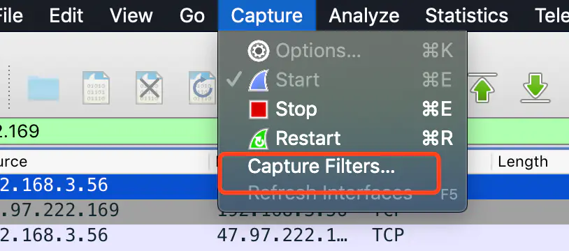
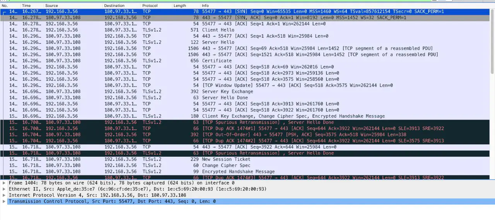
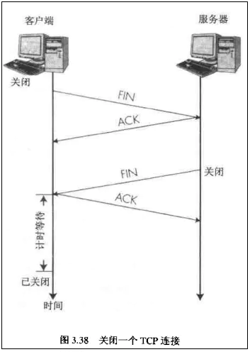
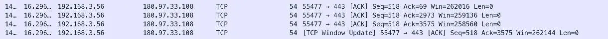
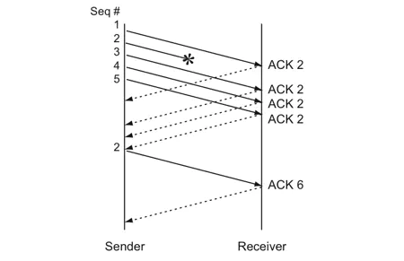

## 参考资料

1. [前端面试每日 3+1](https://github.com/haizlin/fe-interview/blob/master/category/history.md)
2. [Daily-Interview-Question](https://github.com/Advanced-Frontend/Daily-Interview-Question/blob/master/datum/summary.md)
3. [CSS Sprites 精灵图 samllplum](https://blog.csdn.net/sunnyjingqi/article/details/83064872)
4. [作为前端的你了解多少 tcp 的内容 Guokai](https://juejin.im/post/6844903731704791054)

## [html] 你认为 table 的作用和优缺点是什么呢？

### table 布局

#### 优点

1. 对于新手而言，容易上手，尤其对于一些布局中规中矩的网页，更让人首先想到 `excel`，进而通过使用 `table` 去实现它。
2. 表现上更加“严谨”，在不同浏览器中都能得到很好的兼容
3. 通过复杂的表格套表格的形式，也可以实现比较复杂的布局需求。布置好表格，然后将内容放进去就可以了。
4. 它可以不用顾及垂直居中的问题。
5. 数据化的存放更合理。

#### 缺点

1. 标签结构多，复杂，在表格布局中，主要是用到表格的相互嵌套使用，这样就会造成代码的复杂度更高！
2. 表格布局，不利于搜索引擎抓取信息，直接影响到网站的排名

## [css] 解释下 CSS sprites 的原理和优缺点分别是什么？

### 1. 简介

CSS Sprites 在国内很多人叫 css 精灵，是一种网页图片应用处理方式。它允许将一个页面涉及到的所有零星图片都包含到一张大图中， 利用 CSS 的`“background-image”`，`“background- repeat”`，`“background-position”`的组合进行背景定位， 访问页面时避免图片载入缓慢的现象。

### 2. 优点

1. `CSS Sprites` 能很好地减少网页的 `http` 请求，从而大大的提高页面的性能，这是 `CSS Sprites` 最大的优点，也是其被广泛传播和应用的主要原因；
2. `CSS Sprites` 能减少图片的字节；
3. `CSS Sprites` 解决了网页设计师在图片命名上的困扰，只需对一张集合的图片命名，不需要对每一个小图片进行命名，从而提高了网页制作效率。
4. `CSS Sprites` 只需要修改一张或少张图片的颜色或样式来改变整个网页的风格。

### 3.缺点

1. **图片合并麻烦**：图片合并时，需要把多张图片有序的合理的合并成一张图片，并留好足够的空间防止版块出现不必要的背景。
2. **图片适应性差**：在高分辨的屏幕下自适应页面，若图片不够宽会出现背景断裂。
3. **图片定位繁琐**：开发时需要通过工具测量计算每个背景单元的精确位置。
4. **可维护性差**：页面背景需要少许改动，可能要修改部分或整张已合并的图片，进而要改动 css。在避免改动图片的前提下，又只能（最好）往下追加图片，但这样增加了图片字节。

## [js] typeof('abc')和 typeof 'abc'都是 string, 那么 typeof 是操作符还是函数？

`typeof` 是操作符, 此时的括号, 表达的是 `('abc')`, 而并不是 `typeof` 的括号.

## 谈谈你对 TCP 三次握手和四次挥手的理解

### base

OSI(Open Systems Interconncection，开放系统互联)网络分层
从上到下分别是：

1. 应用层(`Application`)
2. 表示层(`Presentation`)
3. 会话层(`Session`)
4. 传输层(`Transport`)
5. 网络层`(Network`) -- 路由器
6. 数据链路层(`Data Link`) -- 交换机
7. 物理层(`Physical`) -- 网卡、集线器（`Hub`）

基础内容不做过多的讲解，有需要的可以[出门右转](https://juejin.im/post/6844903568860774408) ok 我们今天主要关注的是 tcp 层的内容，下面的内容，如果有兴趣建议大家按照步骤实际操作去看看，首先介绍一个工具 `wireshark`，这个工具可以帮助我们抓到 `tcp` 以及更底层的包，下载到[这里](https://www.wireshark.org/),打开后有个 `download`，下载自己系统能用的就好，一路安装到全部完成，接下来我们开始一次实战抓包。

### 抓包

我这里利用了[百度的首页](https://www.baidu.com/)做了一次抓包实验，首先要设置一个过滤

你可以选择 `http` 和 `tcp` 或者 `tcp only`

然后到控制台中去 ping 一下百度首页的 ip

ok 看到 ip 是 `180.97.33.108`

然后我们到 `wireshark` 中设置一下查询的 `ip`

到 chrome 中打开百度的首页，然后就能看到 tcp 的传输信息了

内容有点多，我们通过这个内容来观察一下 tcp 的传输过程

### tcp base

先看下 tcp 的头部报文结构

1. `tcp` 协议层是不关心 `ip` 的，具体 `ip` 的定位是由 `ip` 层来决定的，但是 `tcp` 层需要确定端口号，所以他会携带 `source` 和 `destination` 的 `port` 信息，以便能找到对应的端口号；
2. `sequence number` 实际中使用的 `SEQ`，也就是序号，这个序号起了很重要的作用，我们都知道 `tcp` 和 `udp` 最大的区别在于 `tcp` 是稳定并且有序的，其中 seq 就可以保证有序，当 `A` 向 `B` 发送一个数据包的时候，`seq` 会叠加，每一个传输方在传送数据的时候都会带上这个信息，另一端能按照这个序号来排序收到信息的顺序，从未保证了信息的传递是有序的，也能通过它来确认有没有出现丢包的情况；另外要注意的是当有数据需要发送的时候，`seq` 会随该序列号为原点，对自己将要发送的每个字节的数据进行编号，比如当前 `seq = 10`，本次要发送的数据包大小是 `200` 字节，那么实际发送的时候会更新 `seq=210`，以便保证传输的数据的顺序；
3. `acknowledge number`，实际中使用的 `ACK`，是另一端对对方 se`q 的一个回应，一般会把对方给的`seq+1` 然后下一次发包的时候带上，这样的话对方就知道我们是收到前面的消息的；
4. `windown` 代表的是滑动窗口，实际中用 `win` 来表示，`win` 的大小很重要，`win` 越大的传输越快，因为 `win` 的大小直接决定了某一端一次可以同时发送多少个数据包，而不用等待对方的应答 `ACK` 回来，但是 `win` 会随着每一个数据包的发送而变小(稍后解释)；
5. `reserved` 是 `tcp` 传输很重要的角色，标志位，响应方会根据对方给的信号执行对应的操作，比如执行断开连接的时候一般都是使用 `FIN` 标志位；

基础内容不做过多介绍，不懂的可以移步[这里](https://blog.csdn.net/jijianshuai/article/details/80883091)先看下概念，后面我们会结合实际来介绍

### 三次握手(敲黑板)

观察前几次传输，`TLS` 类型的我们可以先忽略，它是处理 `ssl` 加密的内容，有兴趣的可以自己去 `google`，重点看前三次的 `tcp`，第一次是我们自己的 `ip` 向百度的服务器 `ip` 发了第一个包，`seq=0`，起始的数据信号是 `0，win=65535` 代表我这边的窗口大小是 `65535，len=0` 代表我这边希望接受的包的大小长度是 `0`，`mss` 代表我这边本次传输能接收的最大包的内容是 1460(其余的我们暂时不用关心)。

下面我们模拟一下对话内容：

A：B，你好，我是 A 请求建立连接，我的 seq 是 0，我的 win 是 65535，我希望本次回应我的内容长度 len 为 0，我本次能接收的最大内容是 1460，over； 
B：A，你也好，收到你的信息了，我是 B，我本次的 seq 是 0（注意，双方的序号是独立计算的，这里都从 0 开始的），我回应你的 ack 是 1(A 的 seq+1，代表我收到你 seq 是 0 的消息了)，我的窗口大小是 8192，我希望你回应我本次消息的 len 也是 0，我这边能接收的最大回应大小是 1452，over； 
A：好的，我收到你的回应了，我现在给你发送的 seq 是 1(上一次是 0，这次是 1)，我回应你的 ack 是 1(B 的 seq+1)，我当前的窗口大小是 25984，我希望的回应长度是 0；我们建立好连接了，over； 
到这里，完整的三次握手就结束了，后面就可以执行别的数据传输了，到这里，不知道有没有想过，为什么确定一次连接需要三次握手，不是 1 次，也不是 2 次，也不是 4 次，

**首先，1 次肯定不行，1 次的话 一方无法确认另一方的情况，所以最少都是 2 次起步，**

#### 2 次：

A：喂喂喂，我是 A，你听的到吗？ 
B：在在在，我能听到，我是 B，你能听到我吗? 
A：(听到了，老子不想理你) 
B：喂喂喂？听不听到？我 X，对面死了，我挂了。。 

#### 4 次：

A：喂喂喂，我是 A，你听的到吗？ 
B：在在在，我能听到，我是 B，你能听到我吗? 
A：听到了，你呢？你能听到吗？ 
B：？？你是智障？我不是说了我能听到吗，不想跟 xx 说话。。。 

**所以最合理的还是 3 次：**

A：喂喂喂，我是 A，你听的到吗？ 
B：在在在，我能听到，我是 B，你能听到我吗? 
A：听到了。我们今天去钓鱼吧。。balabala 
so，就是这样，其实不是不能更多，但是可靠的同时，还要考虑性能和时间问题，所以，目前公认的握手次数还是三次比较合理。

### 四次挥手

我们知道 `tcp` 的连接是全双工的，`A` 和 `B` 是可以互相通信的，不理解的话，可以想想打电话（类比，不要当真），打电话的场景就是单双工的，因为同一时间只能一个人说话，另一个人听，如果 2 个人一起说话，那谁都听不清楚了，没有意义，但是 `tcp` 是全双工的，就是 `A`正在给 `B` 发信息的同时，`B` 也在给 `A` 发信息，所以当断开的时候，必须要求双方都得知道，如果只有一方知道，肯定不行，因此，断开的时候，就需要下面这样：

A：B，不好意思，我这边需要关闭连接了，你准备一下？(发了一个 fin 信号给 B，等待回应) 
B：好的 A，我收到你的关闭信号了，我还有数据没发好，你等我下（回应 A，带回去 ACK 的最后一个信息，失败可以重发） 
B：A 老弟，我好了，我可以关闭了，给你最后说一下，等下你回应我的话，我就直接关了； 
A：好的老哥，我回应你一下，你收到就关闭吧，不用理我(发完这条信息后，进入 time_wait 状态) 
B：(收到 ack 信息，直接就关闭了)，此过程不产生数据的交互，不算挥手次数 
A：等待 2MSL(最大报文段生存时间)后，B 没东西给过来，我也关了； 

到这里 4 次挥手就结束了，2 个问题：

#### 1.为什么握手需要三次，而挥手却需要四次？

握手的时候，`A` 和 `B` 打个招呼，`B` 可以直接把自己的 `SYN` 信息和对 `A` 的回应 `ACK` 信息一起带上，但是挥手的时候，`A`说我要断开了，`B` 还没发完最后的数据，因此需要先回应一下 `A`，我收到你的断开的请求了，但是你要等我把最后的内容给你，所以这里分开了 2 步：

1. 回应 A；
2. 发送自己的最后一个数据

#### 2.为什么 A 进入 `TIME_WAIT` 需要等待最大报文段生存的时间后，才能关闭？

原因是，担心网络不可靠而导致的丢包，最后一个回应 `B` 的 `ACK` 万一丢了怎么办，在这个时间内，`A` 是可以重新发包的，但是超过了最大等待时间的话，就算收不到也没用了，所以就可以关闭了

### 如何理解滑动窗口的作用？

从上面的内容，我们简单了解了三次握手和四次挥手的内容，然后也知道了一些报文字段的意义，但是网络本身是不稳定的，也就是说中间无法保证数据包一定会到对面，那么 `tcp` 是如何在尽可能少的时间内实现稳定和有序传输的？

我们知道 `SYN` 信息中会带上自己的 `seq`，序号，这样可以保证另一方接受到后知道如何排序，但是如果发送必须都是同步的，想象，`A` 给 `B` 发送的时候，需要给 B 1，2，3，4，5 个包，发了 1 后，死等 1 的 ack 回来，再给 2，死等 2 的 ack 回来，在 `linux` 下每个 `tcp` 的 `timeout` 最大是 `2^5 - 1 = 63s`(默认的 `retrytime` 是 `5` 次)的时间，因为当发了一个包出去后，在一定时间内没收到 `ACK` 回应，为了确认不能丢包的问题，会启动重试机制，重试 `5` 次，它们的延迟分别是：1 秒、3 秒、7 秒、15 秒、31 秒，其中 31s 是前 5 次重试的时间 1+2+4+8+16=31s，最后的 32s 是等待最后一次重试也超时(等待的时间是 2 的 N 次方秒)，所以一共就是 63s，如果一个一个等，是不是有点太恐怖了，万一网络环境比较差，所以为了能在不丢包的情况下，尽量减少时间的损耗，引入了滑动窗口的概念，window

由于窗口由 16 位 bit 所定义，所以接收端 `TCP`，窗口能最大提供 `65535` 个字节的缓冲，其实这个滑动窗口主要就是做限流和缓冲用的，每一个 `tcp` 传输中的 `win` 提供的是对方的窗口大小，当 A 向 B 发数据的时候，超过 B 的 win 长度的数据会被丢掉，同时窗口还可以提高发送数据的效率，通过类似于并发的行为，如下图：

可以看到 `A` 向 `B` 连续发了 3 条数据，但是回应 B 的 ACK 没有变，也就是说都是回应同一个 `B` 的同一个响应，但是 `A` 自己的 `seq` 更新了 3 次，先是 1，然后是 69 最后是 `1521`，说明这三个包是连续发出去的，实际上只要当前数据包的大小不超过对方的 window 大小，就可以连续发的，接着看：

这四个是 B 响应给 A 的数据包，可以看到都是在响应 A 给的数据包，注意看因为 A 连续发了好几条，B 可能一下反应不过来，所以 B 会把这些信息放到缓冲区，但是放的数据越多，那么自己的缓冲区就越小，就是通过 B 自己的 win 来体现，我们可以看到 B 的 win 再连续变小，说明它还没处理好，到第 4 条信息的时候，我们看到 B 给了一个信息叫 `WINDOW UPDATE` 然后发现 B 的 win 变大了，这就意味着它已经处理好 A 之前连续发的几个数据包了，然后就会重新更新自己的 win 的大小，要注意的是当 tcp 一端的 win 接近或者等于 0 的时候，传输将会停止，直到 `window update` 更新说 `buffer` 已经清空了，传输才会继续。

### 丢包？

看下面这个图

明显能看到 `ACK` 是连续变大的，在一次连接中，不可能存在说先回复 `ACK=3922` 然后再回复 `ACK=3913`，这样的话另一端在收到 `3922` 的时候就认为之前的全部接收到了，实际上 `3913` 还没收到，要注意 `SeqNum` 和 `Ack` 是以字节数为单位，所以 ack 的时候，不能跳着确认，只能确认最大的连续收到的包。那么，考虑以下情况，假如 A 给的分别是 1，2，3，4 到 5 5 个包，B 这边收到 1，Ack 一个 2（代表收到 1 了），然后 2 丢了，3、4 和 5 收到了，能直接 ACK = 6 吗？当然不行，这样的话 tcp 就是不稳定的了，考虑超时重传的 2 种方案：

1. timeout 后只重新传 2；
2. timeout 后重新给 2、3、4、5；

2 种方案有好有坏，第一种比较慢，第二种浪费带宽，所以 `tcp` 引入了一种快速超时重试机制(`Fast Retransmit` 算法)，不以时间计算，而以数据做驱动重新传送，如果包没有连续到达，比如 1 到了，2 没到，3，4，5 也到了，这个时候，B 始终返回 `ACK=2`，代表只确认 1，然后 A 就知道 2 没到，重新发 2，但是 B 一旦收到 2 会直接 `ACK=6` 给 A，这个的意思就是说 2 拿到后，345 也收到了，直接给 6 就 ok，如下图：

上面说的只是一种特别简单的方案，目前，linux2.4 之后，采用了一种更先进的方式，有想了解的可以走[这里](https://coolshell.cn/articles/11564.html)

### 攻击

典型的场景是 DDOS 攻击，也可以说是 tcp 的 SYN Flood 攻击，又叫洪水攻击；

根据上面的分析，我们知道 tcp 的握手环节是比较耗时的，当 client 端发起连接请求的时候，server 端会回应，然后等待 client 的最终确认信息，默认情况下的 linux 会等待 1 到 63s 这样(如果有特殊的设置，这个时间可以到 1-2min 这样)，默认最长是 63s 之后才会断开，之前这段时间内属于半连接的状态，服务器不会丢弃掉这些连接，而是会等，试想如果有一个人突然想你的 server 瞬间之内发送了几千万个连接请求，但是对服务端的响应不做理睬，这样很容易就导致我们正常的 tcp 连接进不去，从而出现服务拒绝的情况，而他只需要一个简简单单的脚本去给你丢包就可以了，这种情况就会导致服务器对正常的客户端表现为宕机。。

此种攻击的成本比较低，但是防护却特别麻烦，因为你必须要保证正常的不能因为访问次数的提高而出现拒绝。
