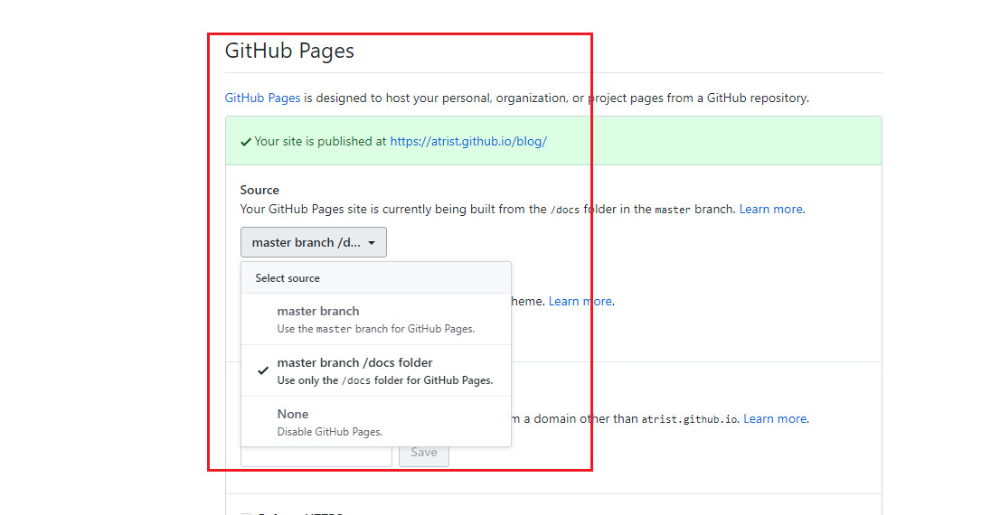

## 参考资料
1. [vuepress的官方部署文档](https://vuepress.vuejs.org/zh/guide/deploy.html#github-pages)
## githubPage

### 1. 申请一个github仓库,并与本地代码库进行绑定
### 2. 修改vuepress的配置
我的文件目录结构:
```
- blog
    - docs
    - main
        - _posts
        - .vuepress
            - components
            - public
            - config.js
            - enhanceApp.js
```
1. 我的文档是放置 `main`目录下
2. 我的编译输出文档是`docs`,便于githubPage的托管


**修改config.js文件**
```js
// .vuepress/config.js
module.exports = {
    // 编译输出位置
    dest: './docs',
    // 这里的base,需要 与github远程仓库同名
    base: '/blog/',
}
```

**修改package.json文件**
```json
    "scripts": {
        "dev": "vuepress dev ./main",
        "build": "vuepress build ./main"
    },
```
### 3. 代码本地运行一次 `build`,然后上传
### 4. 在github仓库页修改设置




## 服务器

待做